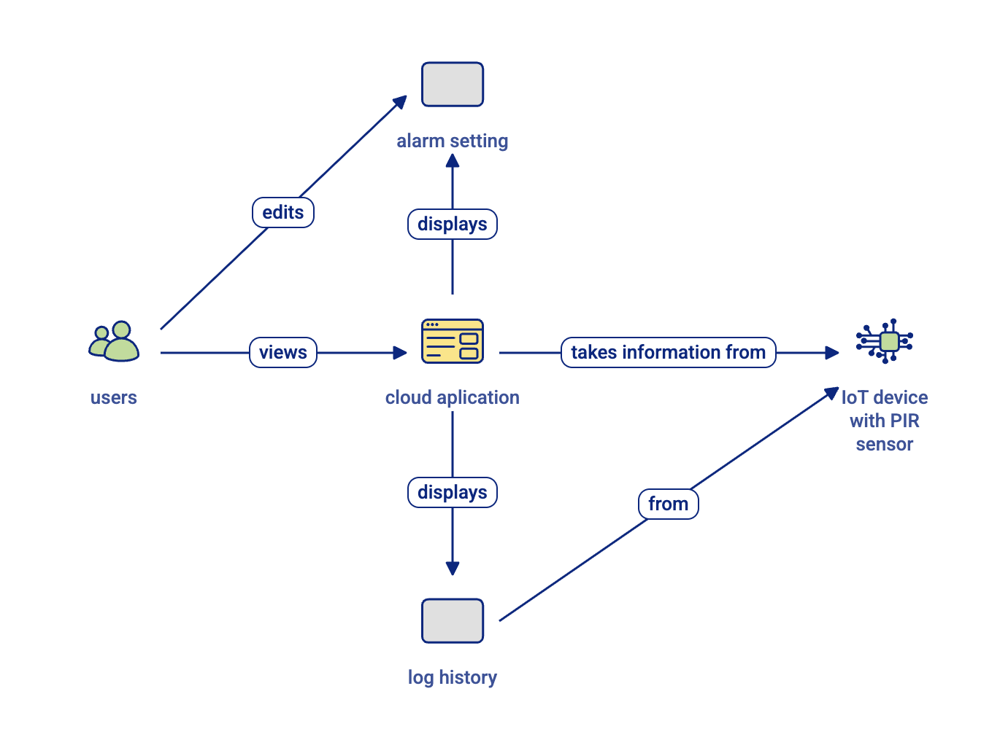
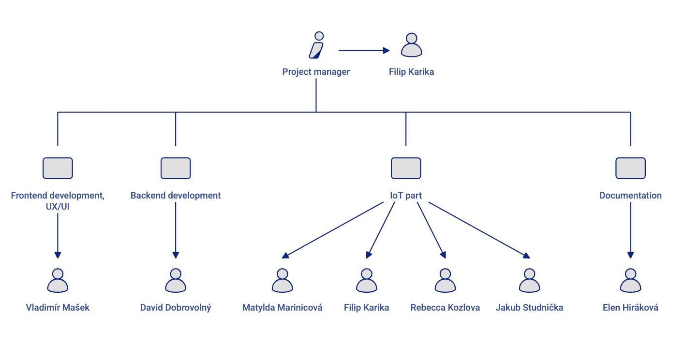
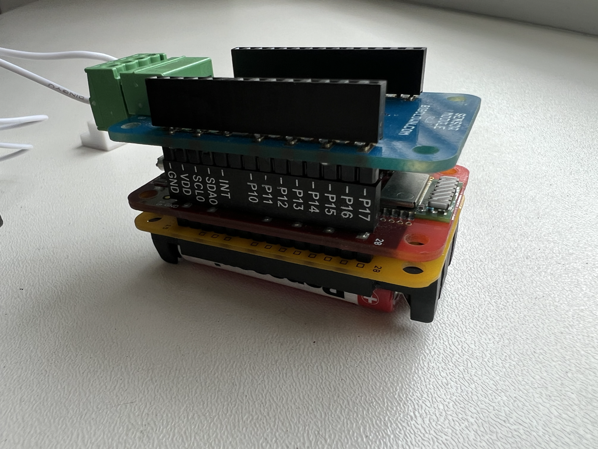
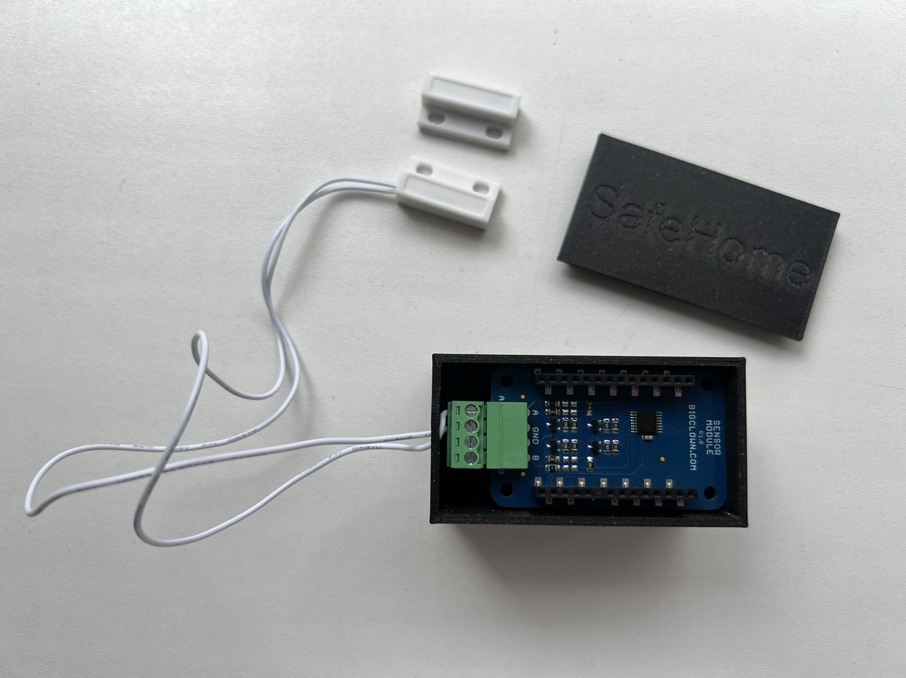
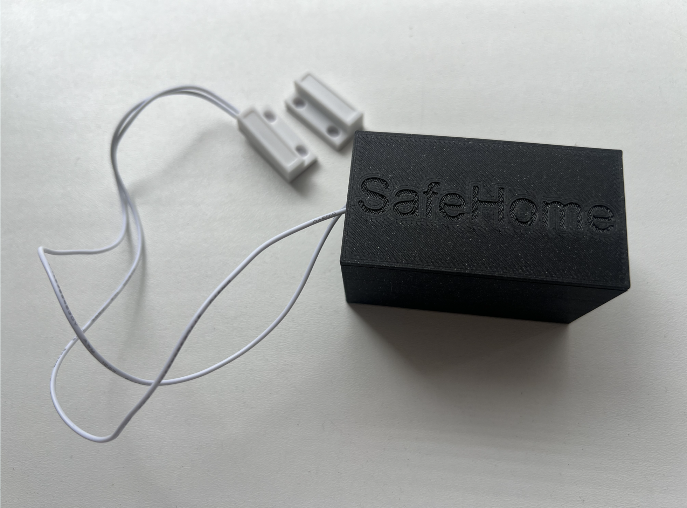

# SafeHome - IoT Alarm System

This repository contains both the frontend, backend, node-RED flows, documentation and images of hardware components of the IoT Alarm System.



*Overview of the IoT Alarm System architecture and logic flow*

## Live Application

The application is currently deployed and running at:
- **Main Application**: https://safehome-zx9i.onrender.com/
- **Login Page**: https://safehome-zx9i.onrender.com/login

## Team

+ [@Filip Karika](https://github.com/sknefi)
+ [@Rebecca Kozlova](https://github.com/rebi-05)
+ [@Vladimír Mašek](https://github.com/VladimirMasek)
+ [@David Dobrovolný](https://github.com/fathaaland)
+ [@Matylda Marinicová](https://github.com/-)
+ [@Elen Hiráková](https://github.com/-)
+ [@Jakub Studnička](https://github.com/jstudnic1)



*Team members who contributed to the development of this IoT Alarm System project.* 

## Documentation

Complete business and application documentation can be found in the `/documentation` directory.

## Project Structure

- `alarm_system.fe/` - Frontend React application built with Vite
- `alarm_system.be/` - Backend Express server
- `documentation/` - Complete business and technical documentation

## Node-RED Flow

This project includes Node-RED flows for IoT device integration:

- **Local Development Flow**: Available for localhost development `node-red/safehome.json`
- **Production Flow**: Configured for the deployed version `node-red/deployed-safehome.json`

### Node-RED Setup Instructions

1. When running Node-RED, click on the first node labeled **'Startup & every 15m'**
2. Configure the node with your refresh token (obtain this after login from Insomnia/Postman or similar API client)
3. **Important**: When working with devices, change their alias to match their hardware ID for proper identification

## Device Management

When configuring IoT devices in the system:
- Ensure device aliases correspond to their actual hardware IDs
- This is crucial for proper device identification and communication

## Local Development

For local development, run the frontend and backend separately:

1. Frontend:
   ```
   cd alarm_system.fe
   npm install
   npm run dev
   ```

2. Backend:
   ```
   cd alarm_system.be
   npm install
   npx nodemon src/server.js
   ```

## Deployment to Render

This application is configured for deployment to Render as a single service.

### Automatic Deployment

This repository includes a `render.yaml` file that can be used for Blueprint deployments on Render.

## Environment Variables

Make sure to set the following environment variables in your Render dashboard:

- `MONGODB_URI`: Your MongoDB connection string
- Any other environment variables used in your application

**Note**: Both frontend (`alarm_system.fe/`) and backend (`alarm_system.be/`) directories contain a `dotenv` file with all necessary environment variable information. However, the `MONGODB_URI` is intentionally omitted from these files for security reasons to prevent potential project sabotage.

## Logging & Notifications

The system maintains comprehensive logging and sends push notifications to household members via Discord for real-time monitoring and alerts.

## WebSocket Connection

For WebSocket connections in production, make sure to connect to the correct endpoint:

```javascript
const wsProtocol = window.location.protocol === 'https:' ? 'wss:' : 'ws:';
const wsUrl = `${wsProtocol}//${window.location.host}/ws`;
const socket = new WebSocket(wsUrl);
```

## Hardware

The IoT Alarm System utilizes custom hardware components for comprehensive home security monitoring:

### All components


### Set up of SafeHome Box


### Completed product

*Custom IoT hardware components used in the alarm system*